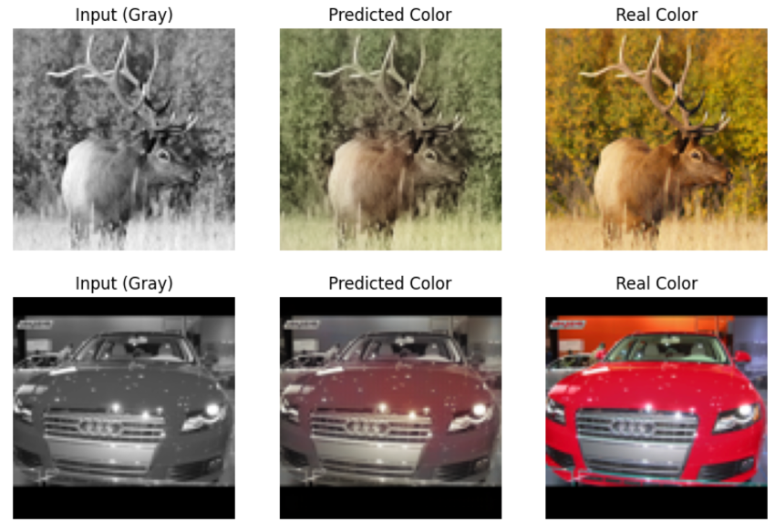

# Coloración de Imágenes  
**Álvaro Felipe Pérez¹, Miguel Gómez Prieto¹, Hugo Gómez‑Caraballo López‑Romero¹ y Carlos Serrano Pinós¹**  
¹Estudiante CDIA, Universidad Politécnica de Madrid, Madrid

## Resumen
La coloración automática de imágenes en escala de grises constituye un desafío relevante en visión por computador, al requerir la generación de información cromática plausible a partir de datos incompletos. En este trabajo se presenta un análisis comparativo de diferentes arquitecturas de aprendizaje profundo aplicadas a la coloración de imágenes, incluyendo Autoencoders (AE), Variational Autoencoders (VAE), redes UNet, Generative Adversarial Networks (GAN), modelos de difusión y enfoques guiados por texto.

Los experimentos se realizaron sobre el conjunto de datos **STL‑10** y un dataset complementario de **flores**, con el objetivo de evaluar la capacidad de cada modelo para reconstruir color de manera realista y coherente con el contenido semántico. Se discuten las ventajas y limitaciones de cada aproximación, así como la influencia de la resolución y el tipo de condicionamiento en la calidad perceptual de los resultados.

Los hallazgos contribuyen a comprender el potencial y las fronteras actuales de las técnicas de coloración basadas en *deep learning*.

## Keywords
- Image colorization  
- Autoencoder  
- UNet  
- Generative Adversarial Network  
- Diffusion models  
- Text‑guided coloration  
- Computer vision

## Ejemplo resultados



## Licencia
Este proyecto se distribuye bajo la **licencia MIT**.

## Citación (BibTeX)

```bibtex
@misc{perez2025coloracion,
  title        = {Coloración de Imágenes},
  author       = {Pérez, Álvaro Felipe and Gómez Prieto, Miguel and Gómez-Caraballo López-Romero, Hugo and Serrano Pinós, Carlos},
  year         = {2025},
  institution  = {Universidad Politécnica de Madrid},
  note         = {Trabajo académico sobre coloración automática de imágenes mediante deep learning}
}
```
